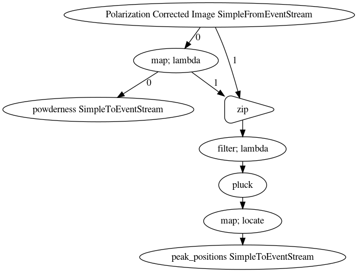

# Summary

The shed-streaming package provides a python based software framework for 
real time analysis of streaming data with provenance.  It is highly
flexible, allowing analysis pipelines to be built for any variety of
experimental data that is arriving in a time series.  It allows straightforward
serialization of the pipeline, and the analysis results, for storage in databases
with provenance information that allows analyses later to be pulled from the databases,
adapted if desired, and rerun.

# Statement of Need

The accelerating rate of data coming from modern scientific experiments
enables completely new classes of experiments to be carried out such as
*in situ* and *operando* measurements of time-dependent phenomena.
Many current and planned world-class experimental facilities such as
x-ray synchrotron sources produce mountains of data.
Real-time processing of these large volumes of data can be made possible by streaming
data processing, where the data is processed and reduced as it is being collected.
While many streaming data processing systems exist
[@silva2007][@davison2014][@picard2018][@carbone2015][@murray2013] 
few handle the heterogeneity which is prevalent in many experimental environments.  For
example, x-ray synchrotrons support thousands of users per year doing a wide
array of bespoke experiments and measurements.
Additionally, few streaming systems track the provenance of the processed
data, creating reproducibility and discoverability concerns.

``shed-streaming`` is a Python package for handling heterogeneous streaming data and
tracking the provenance of the produced results.
The ``shed-streaming`` API translates data coming from a streaming experiment
into python objects
which are passed into data processing pipelines written using the ``rapidz``
library.  It expects data in the form of the Bluesky Event Model schema,
which is a flexible open-source document model suitable for scientific
time-series experiments.  The Bluesky event model [@koerner2020] is 
used by nearly all of the beamlines at the National Synchrotron Light Source-II 
(NSLS-II) as well as at other facilities.  
``shed-streaming`` also provides translation from the python objects flowing through
a ``rapidz`` pipeline back into the Event Model enabling the use of data visualization
and storage tools written for the Event Model.
In addition to the translation features shed-streaming passively tracks the provenance
of produced data, capturing the data processing pipeline, data unique IDs,
and the order of data insertion into the pipeline.
The pipeline is captured in a way which is both human and machine-readable,
enabling searching and comparison of analyzed data sets.
An extendable system also captures information about the software environment
in which the pipeline ran, including the conda environment, allowing in principle
data analysis campaigns to be serialized into a database then later 
recovered and rerun, or adapted and then rerun and stored independently.

``shed-streaming`` is designed to provide a bridge between the data collected from 
high throughput experiments if they are, or can be put, into event model form
(such as data from NSLS-II experiments),
and the NSLS-II's data visualization and storage tools.
This system has been used to write x-ray scattering data processing 
pipelines currently used in production at the NSLS-II XPD and PDF beamlines
(28-ID-2 and 28-ID-1, respectively).  The design and some applications of
shed are described in greater detail in [@wright2020].

# Figures

Example data processing pipeline with shed-streaming nodes.

# Acknowledgments

This work was supported as part of GENESIS: A Next Generation Synthesis Center, 
an Energy Frontier Research Center funded by the U.S. Department of Energy, 
Office of Science, Basic Energy Sciences under Award Number DE-SC0019212

# References

